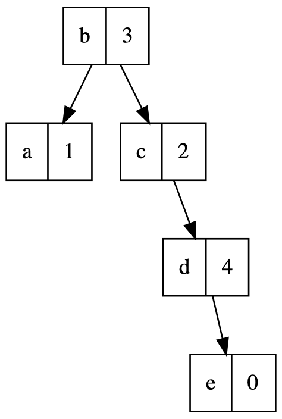

# Functional Programming - TP 3: Pattern Matching

This exercise set is intended to help you practice pattern matching.

## Introduction to Pattern Matching

In previous exercises, we used `if` conditionals and `.` field accessors to write functions on data types such as lists or trees. This week, we'll use pattern matching to make these functions more succinct and readable. We'll move from this:

```scala
def reduceIf(f: (Int, Int) => Int)(l: IntList): Int =
  if l.isEmpty then throw IllegalArgumentException("Empty list!")
  else if l.tail.isEmpty then l.head
  else f(l.head, reduceIf(f)(l.tail))
```

to this:

```scala
def reduceMatch(f: (Int, Int) => Int)(l: IntList): Int =
  l match
    case IntNil              => throw IllegalArgumentException("Empty list!")
    case IntCons(hd, IntNil) => hd
    case IntCons(hd, tl)     => f(hd, reduceMatch(f)(tl))
```

Most functional programmers find the second one much more readable, because it aligns the way the data is *destructed* (taken apart into a head and a tail) and the way the data is *constructed* (assembled from a head and a tail):

> [!NOTE]
> in this function, the `f` is a higher-order argument. We will discuss them in detail later.

```scala
def constructDestruct =
  IntCons(1, IntCons(2, IntNil)) match
    case IntCons(a, IntCons(b, IntNil)) =>
      println(s"Found $a and $b")
    case _ => throw Exception("Not possible!")
```

> [!WARNING] 
> Previously, we wrote `IntNil()` for empty `IntList`s. Now that we know about `enum`s and case classes, we can use the more succinct and convenient syntax `IntNil` (no parentheses).

<details>
<summary> Hint </summary>

If you find yourself looking for more examples of pattern matching after completing this set, consider revisiting week 1 and week 2 exercises and redefining all the functions with pattern matching.
</details>


## Weekdays ([Weekday.scala](./src/main/scala/patmat/Weekday.scala) & [WeekdayOps.scala](./src/main/scala/patmat/WeekdayOps.scala)) ⭐️

Days of the week are a great example of simple enumerations. So, which day is tomorrow? let's implement a function to find out.

The `enum` representing weekdays is defined as follows (in [Weekday.scala](./src/main/scala/patmat/Weekday.scala)):

```scala
enum Weekday:
  case Monday
  case Tuesday
  case Wednesday
  case Thursday
  case Friday
  case Saturday
  case Sunday
```

Complete the following two functions (in [WeekdayOps.scala](./src/main/scala/patmat/WeekdayOps.scala)):

1. `next` returns the next day of the week:
   ```scala
   def next(d: Weekday): Weekday =
     ???
   ```
2. `prev` returns the previous day of the week:
   ```scala
   def prev(d: Weekday): Weekday =
     ???
   ```

<details>
<summary> Hint </summary>

Want to test your code? Run `testOnly WeekdayOpsTest` in `sbt`.
</details>


> [!NOTE]
> This exercise is taken from [Logical Foundations](https://softwarefoundations.cis.upenn.edu/lf-current/Basics.html), a book about mathematical proofs of programs, and translated into Scala.

## Tri-booleans ([TriBool.scala](./src/main/scala/patmat/TriBool.scala) & [TriBoolOps.scala](./src/main/scala/patmat/TriBoolOps.scala)) ⭐️

By now you're very familiar with Booleans. But in real life, not every thing is `Yes` or `No`: sometimes we just don't know! Tri-boolean logic helps with this by adding an indeterminate value, `Maybe` (in [TriBool.scala](./src/main/scala/patmat/TriBool.scala)):

```scala
enum TriBool:
  case Yes
  case No
  case Maybe
```

`Maybe` is like a Boolean value that is not yet known. 

1. Take the time to think of how `Maybe` combine with `Yes` and `No`.

- If I have two objects, one which is for sure blue, and one that may be blue, then can I say that I have at least one blue item? Is that for sure or maybe? What does this entail about the “or” operator on tri-Booleans?

- If I have the same two objects (one blue, one maybe blue), can I conclusively say that not all or my objects are blue? Can I promise that they are all blue? What does this entail about the “and” operator on tri-Booleans?

2. Implement the following operations (we expect that you'll find pattern-matching very nice for that!)

```scala
def neg(b: TriBool): TriBool =
  ???
```
```scala
def and(b1: TriBool, b2: TriBool): TriBool =
  ???
```
```scala
def or(b1: TriBool, b2: TriBool): TriBool =
  ???
```
```scala
def nand(b1: TriBool, b2: TriBool): TriBool =
  ???
```

<details>
<summary> Hint 1 </summary>

For pattern-matching two values simultaneously, often the following style is used:

```scala
  (b1, b2) match
    case (Yes, Yes) => [...]
    case (Yes, No)  => [...]
```
</details>

An alternative is to use nested match-expressions.

<details>
<summary> Hint 2 </summary>

Want to test your code? Run `testOnly TriBoolOpsTest` in `sbt`.
</details>

> [!NOTE] 
> `nand` is a very surprising operator. If you're not familiar with it, inspect the test cases, or [read more about it!](https://en.wikipedia.org/wiki/Sheffer_stroke)

## Contexts ([EnumContext.scala](./src/main/scala/patmat/EnumContext.scala)) ⭐️

Now that you have a bit of experience with pattern matching, let's use it to construct more complex types. In this exercise we'll study *contexts*, which are essentially lists of keys and values. 

Our contexts associate names (`String`s) with values (`Int`s), and let us do the following:

- Create an empty context;
- Add an additional key/value pair (called a “binding”) to a context;
- Look up a key to retrieve the corresponding value;
- Remove a key and its corresponding value.

For instance, we can have a context which associates `"x"` with `1` and `"y"` with `2`. We can then look up the keys: looking up `"x"` in the context produces `1`, looking up `"y"` produces `2`, and looking up `"z"` or any other name results in a not-found error. We can add more mapping in the context: after associating `"z"` with `3`, looking `"z"` up in the new context will result in `3`, instead of an error.

Think of what Scala types and features you may use to represent a context before proceeding.

> [!NOTE]
>  Think about your answer before opening the file.

<details>
  <summary>Our choice of representation (already in <code>EnumContext.scala</code>)</summary>
    We'll start by representing contexts using an enum (and we'll see another representation later):

```Scala
enum Context:
  case Empty
  case Cons(name: String, value: Int, tail: Context)
```
    
  We have two cases:
  - `Empty`, which represents an empty context;
  - `Cons`, which forms a new context by associating a new name with its value in an existing context.

  For example, the context that associates `"x"` with `1` and `"y"` with `2` can be represented as `Cons("x", 1, Cons("y", 2, Empty))`, or `Cons("y", 2, Cons("x", 1, Empty))`.
  
</details>

> [!NOTE] 
> If you want to experiment with contexts in the playground, make sure to add `import EnumContext.*` to bring `Cons` and `Empty` into the worksheet's scope.

> [!WARNING]
>  When multiple bindings in a context have the same name, only the outermost is effective. For instance, given a context `Cons("a", 1, Cons("b", 2, Cons("a", 3, Empty)))`, looking up `"a"` this context should return `1` instead of `3`.

Implement the following three functions (in [EnumContext.scala](./src/main/scala/patmat/EnumContext.scala)):

- `empty` returns an empty context:
  ```scala
  def empty: Context =
    ???
  ```
- `cons` forms a new context by associating a new pair of name-value in an existing context:
  ```scala
  def cons(name: String, value: Int, rem: Context) =
    ???
  ```
- `lookup` looks a name up in a given context:
  ```scala
  def lookup(ctx: Context, name: String): LookupResult =
    ???
  ```

  Notice the return type: we used another `enum`, called `LookupResult`, to capture two possible results: either finding a value, or indicating that the name could not be found.
  ```scala
  enum LookupResult:
    case Ok(v: Int)
    case NotFound
  ```
  
- `erase` drops **all** bindings with the given name in the context:
  ```scala
  def erase(ctx: Context, name: String): Context =
    ???
  ```

<details>
<summary> Hint </summary>

Want to test your code? Run `testOnly EnumContextTest` in `sbt`.
</details>

## Tree Mapping and Reducing ([IntTree.scala](./src/main/scala/patmat/IntTree.scala) & [IntTreeOps.scala](./src/main/scala/patmat/IntTreeOps.scala)) 🔥

<details>
<summary> Hint </summary>

Want to test your solutions in this chapter? Run `testOnly IntTreeOpsTest` in `sbt`.
</details>

Last week we worked with trees using a clunky API of `.left`, `.right`, and `.isEmpty`. This time, let's do it the right way. And, to mix things up a bit, we'll see a tree that contains values only at the leaves, instead of in every node.

The `IntTree` `enum` is defined as the following (in [IntTree.scala](./src/main/scala/patmat/IntTree.scala)):

```scala
enum IntTree:
  case Leaf(value: Int)
  case Branch(left: IntTree, right: IntTree)
```

What might be the `enum` representation of the tree below?

<details>
  <summary>Solution</summary>

  ```Scala
Branch(Branch(Leaf(1), Leaf(2)), Leaf(3))
  ```
</details>


### Tree Mapping

Let's start with the `treeMap` function (in [IntTreeOps.scala](./src/main/scala/patmat/IntTreeOps.scala)):

```scala
def treeMap(tree: IntTree, value: Int): IntTree =
    ???
```

It takes a tree and adds a specified value to each leaf node.

For instance, let's name the tree we just saw in the diagram as `t`. The following diagram dipicts the computation of `treeMap(t, 1)`.


We will later see a generalized `treeMap` function that can apply arbitrary functions to the values in a tree.

### Tree Reducing

The second task is the `treeReduce` function (in [IntTreeOps.scala](./src/main/scala/patmat/IntTreeOps.scala)):

```scala
def treeReduce(tree: IntTree): Int =
    ???
```

Given a tree, the function returns the sum of all leaf nodes. The diagram below depicts the process `treeReduce(t)`.


Intuitively, it is a *bottom-up* aggregation of values in the leaves. The values flow from the bottom to the root. At each branch node, the aggregated results from the two children are merged.

But many of us prefer to think of it as a “pull” operation: to compute its own value, each internal node “pulls” the values of the subtrees by making recursive call.

A bit more formally,

- For each branch node, e.g. `Branch(left, right)`, the function should recurse on both left and right and merge the results.
- For the leaf node, e.g. `Leaf(value)`, the value is returned.

Again, we will later see `reduce` in a more general setting, not just summation of values.

## IntList ([IntList.scala](./src/main/scala/patmat/IntList.scala) & [IntListOps.scala](./src/main/scala/patmat/IntListOps.scala)) 🔥

You already used `IntList`s in last weeks exercise, let's implement a few functions again, this time with pattern matching. Before starting this part of exercises, we suggest you implementing several `IntList` questions from previous weeks' exercises using pattern matching to warm yourself up!


<details>
<summary> Hint </summary>

Want to check answers in this section on computer? Test them with `testOnly IntListOpsTest`.
</details>


### polishEval

First, rewrite `polishEval` ([from last week](../TP2/)) with pattern-matching (in [IntListOps.scala](./src/main/scala/patmat/IntListOps.scala)):

  ```scala
  def polishEval(l: IntList): (Int, IntList) =
    ???
  ```

Throw `InvalidOperationNumber exception` if the operator is not defined, and `InvalidExpression` if the input is not a valid polish-notation expression.

Compare your version with the original `if`-based implementation. Which one is more readable?

### extractSecond

Enumerations and case classes are often useful to distinguish multiple kinds of results. In an imperative language this would often be done with an exception: a function returns a result, and may throw various exceptions if the result cannot be computed. In Scala (and functional programming), we tend to use case classes instead, with one case per kind of result.

For example, a function that extracts the second element of a list might return a type like the following:

```scala
enum ExtractResult:
  case SecondElem(i: Int)
  case NotLongEnough
  case EmptyList
```

When the input list is empty, `extractSecond` returns `EmptyList`; when the input list is not long enough to have a second element (i.e. it only has one element), `extractSecond` returns `NotLongEnough`; finally, when the input list has a second element, the function returns it.

Implement `extractSecond`:

  ```scala
  def extractSecond(l: IntList): ExtractResult =
    ???
  ```

### zipping and unzipping

We have studied many functions on single lists, and also seen that some of these generalize to trees; here, we will introduce some of the most essential operations on multiple lists.

Let's define a type IntIntList of lists of pairs of `Int`s:

```scala
enum IntIntList:
  case IntIntNil
  case IntIntCons(xy: (Int, Int), xs: IntIntList)
import IntIntList.*
```

1. Implement a function `zip` to construct a list of pairs from a pair of lists:

```scala
def zip(l1: IntList, l2: IntList): IntIntList =
  ???
```

Here is one possible specification for `zip`, using `l[n]` to mean "the `n`-th element of list `l`": Given two lists `xs` and `ys`, let `zs` be `zip(xs, ys)`. Then, `zs` should have length `min(length(xs), length(ys))`, and the `i`-th element of `zs` should be `(xs[i], ys[i])` for all `i`.

Note the part about the length of `zs`. For instance, `zip(IntNil, IntCons(1, Nil))` should equal to `IntIntNil`.

2. Define a function `unzip` to construct a pair of lists from a list of pairs:

```scala
def unzip(l: IntIntList): (IntList, IntList) =
  ???
```

3. What relations are there between `zip` and `unzip`? Are you able to prove those relations?

4. Use your function `zip` to implement a function `movingWindow` on lists that returns sequences of consecutive pairs in its input list. For example, `movingWindow` applied to the list `a b c d e` should produce the list `ab bc cd de`.

```scala
def movingWindow(l: IntList): IntIntList =
  ???
```


## Contexts as Binary Search Trees ([BST.scala](./src/main/scala/patmat/BST.scala) and [BSTOps.scala](./src/main/scala/patmat/BSTOps.scala)) 🔥

The contexts that we have seen up to this point are a bit inefficient: lookups take  $\mathrm{O}(n)$, where $n$ is the number of bindings.  Let's do better.  We want a data structure that allows us to do fast insertions, retrievals (lookups), and removals.

- Think about the requirements above. Are some of these operations already fast with function contexts? How about with linked-list contexts?

In this exercise, we will explore “binary search trees”, a kind of tree data structure that exploits the fact that keys can be *ordered* (sorted) to distribute the names into a sorted data structure in which lookups are more efficient (especially when compared to searching through every element in a linked list!).

In general, binary search trees (BSTs) can store sets of any types of values, or mappings from any types of keys to values.  In this exercise we consider BSTs that associate strings to integers (like our previous contexts).

### Definition

So, what are BSTs? Let's see some examples!

1. The following tree stores the bindings `"a" → 1`, `"b" → 2` and `"c" → 0`.
   (We use `"a" → 1` to mean a binding that associates `"a"` (a key) with `1` (a value)).


<i style="color:gray"> Illustration of a BST. </i>

   Each box denotes a node, whose left part is the key and right part the value.

1. This one stores `"a" → 1`, `"b" → 3`, `"c" → 2`, `"d" → 4`:


<i style="color:gray"> Illustration of another BST. </i>

Look carefully at these examples.  What properties (“invariants”) do their nodes have?  Do you see a common pattern?

<details>
<summary>Show the answer</summary>

BST keys are *ordered*: a node with key `k` and two children `left` and `right` has the *BST property* if all keys in its `left` subtree are less than `k`, and all keys in its `right` subtree are greater than `k`.  Notice that there are no constraints on the values: in the examples above, the strings are ordered but the values are not.


<i style="color:gray"> BST principle. </i>

</details>

<div class="note check">

Construct a BST that stores `"a" → 1`, `"b" → 3`, `"c" → 2`, `"d" → 4` and `"e" → 0`.

> [!NOTE]
> The answer is not unique: any tree that conforms to the principle and stores these bindings works.

<details class="hint">
<summary>Reference tree</summary>


</details>

</div>

Here is the Scala `enum` that we'll use to represent BSTs:

```Scala
enum BSTContext:
  case Leaf
  case Branch(k: String, v: Int, l: BSTContext, r: BSTContext)

  def isLeaf: Boolean = this match
    case Leaf      => true
    case _: Branch => false

  def key: String = this match
    case Leaf               => throw RuntimeException("key of a leaf")
    case Branch(k, v, l, r) => k

  def value: Int = this match
    case Leaf               => throw RuntimeException("value of a leaf")
    case Branch(k, v, l, r) => v

  def left: BSTContext = this match
    case Leaf               => throw RuntimeException("left of a leaf")
    case Branch(k, v, l, r) => l

  def right: BSTContext = this match
    case Leaf               => throw RuntimeException("right of a leaf")
    case Branch(k, v, l, r) => r
```

It closely mirrors the structure of the trees pictured above:
- A `Branch` is a node, with the `k`-`v` pair and two subtrees.
- `Leaf` represents missing subtrees. They are not drawn on the diagrams above:
  when a subtree is missing in the diagram, there is implicitly a leaf in its position.

Compare this type to the `EnumContext` that we saw previously. How does it differ?

### Basic operations

1. Implement `lookup` on BST contexts ([BSTOps.scala](./src/main/scala/patmat/BSTOps.scala)). If a branch's root does not match the key that you are looking for, how can you (quickly) determine whether to explore the left or right subtree?

```Scala
def lookup(bst: BSTContext, key: String): LookupResult =
  ???
```

2. Implement `insert`:

```Scala
def insert(bst: BSTContext, key: String, v: Int): BSTContext =
  ???
```


To get you a feeling of why looking up bindings in a BST is fast, consider the following questions:

1. In the worst case, how many steps it will take to lookup a BST of depth $d$? (The *depth* of a BST, or its *height*, is the length of the longest path from the root to a leaf.)

   <details>
   <summary>Answer</summary>

   $d$.

   </details>

2. How many bindings can a BST of depth $d$ store?

   <details>
   <summary>Answer</summary>

   $2^d-1$.

   </details>

3. If we were to store that many bindings in a context-like structure, what would be the worst-case lookup time?

   <details>
   <summary>answer</summary>

   $O(2^d-1)$.

   </details>

### Rotations

The performance of `lookup` in a BST context depends on how deep the node containing the corresponding key is: in the worst case (when the node is the furthest one from the root), a lookup can take time proportional to the depth of the tree.

This is bad!  There is nothing in our implementation above that guarantees that a BST will be *balanced*, so we have no guarantees that the data will be evenly packed together: we may get some very long paths, and some very short ones.  In fact, let's look at an example:

- Draw the tree that results from calling `insert` with the following bindings, in order: `"a" → 1`, `"b" → 2`, `"c" → 1`, `"d" → 2`, `"e" → 0`, `"f" → 5`.  What shape do you get?

It would be much preferable to produce *balanced* BSTs.  A full balanced BST is beyond the scope of this exercise, but we can look at the most important operation: [rotations](https://en.wikipedia.org/wiki/Tree_rotation).

The following diagram illustrates two rotations (left and right), with the root node colored in blue:


<i style="color:gray"> Illustration of rotation. </i>


Take the left rotation as an example: it transforms an input tree in the form of the left hand side into the right hand side.  The tree root changes from `k1` to `k2`.

- Why do rotations preserve the BST property?
- What does the tree look like if we right-rotate the aforementioned degenerated BST?
- What if we right-rotate twice?

Most self-balancing BSTs use rotations to preserve balance across insertions (famous examples include AVL trees and Red-black trees).

You should now be ready to implement rotations:

```Scala
def rotateLeft(tree: BSTContext): BSTContext = 
  ???

def rotateRight(tree: BSTContext): BSTContext =
  ???
```

Can you implement `rotateLeft` with `if`s instead of pattern matching?
Which version is more readable?
