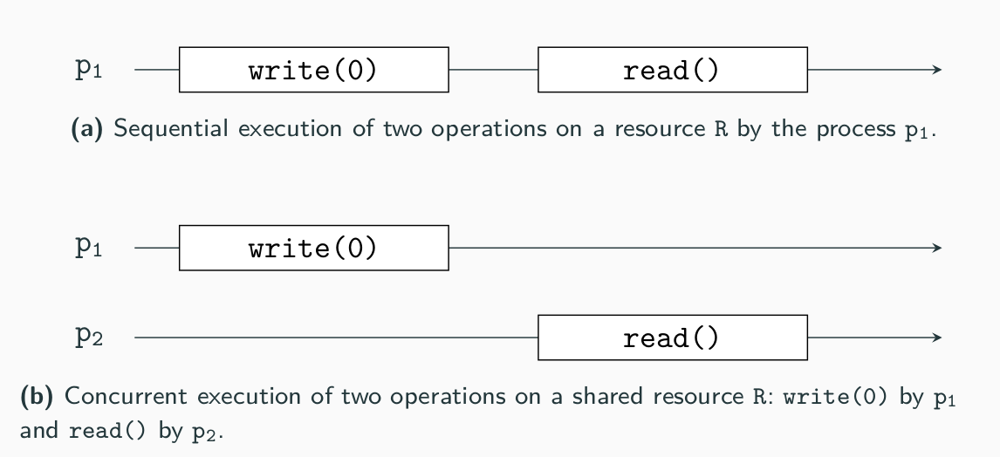
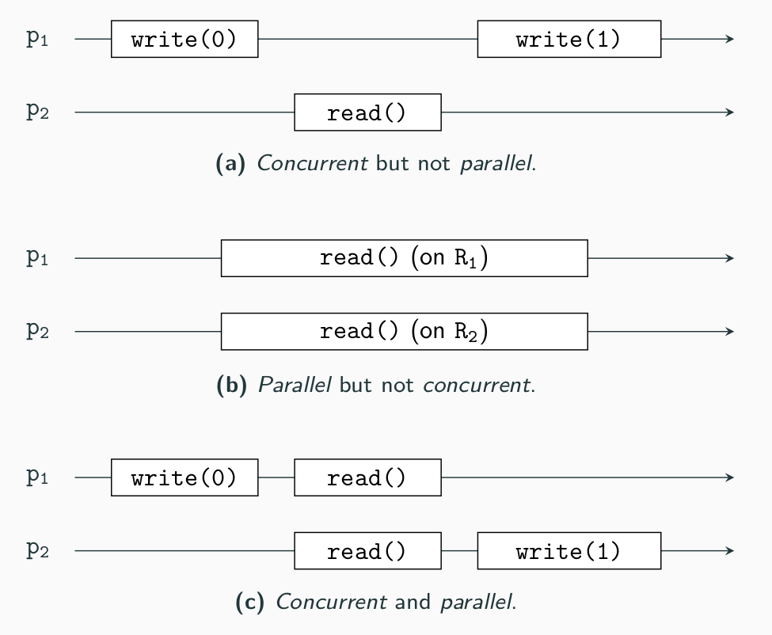

# Functional Programming - TP 6: Parallel Programming

In this exercise, you wil get familiar with the notions of parallelism, concurrency, asynchronicity, and learn how to program using threads, actors, futures, and so on.

## Sequential, Parallel or Concurrent?  

Let us start by those three notions. For you, what is the difference between sequentiality, parallelism and concurrency? Can you find an example of something (a program, a real-life situation) that is parallel but not concurrent, and vice-versa? Can you draw a sequential, a parallel and a concurrent execution of a program (please specify the number of processes, the shared ressources, etc)? Can a program have those three characteristics at the same time? Which combinations are allowed? 

  
Solution

* In a sequential execution, every action is executed one after the other.
* Parallelism refers to the *behaviour of the program at running time*. In a parallel execution (with more than one process), the two processes are working at the exact same time. 
* Concurrency refers to the *conceptual* part of a program. In a concurrent execution (with more than one process accessing a shared ressource), different processes are working on the same shared ressource.

 

* Sequential: (e.g.: a supermarket with only one cashier). Sequential activities depends from each other and are not executed simultaneously, and so they cannot be parallel or concurrent.
* Parallel but not concurrent: more than one process and no shared ressources (e.g.: a restaurant, each client eating its own food at the same time).
* Concurrent but not parallel: more than on process accessing the same ressource at different times (e.g.: cashiers incrementing the global sale amount). 
* Parallel and concurrent: more than one process accessing a shared ressource at the same time (e.g.: multiple reads in a database, human breathing in a classroom).

Now, you can explore those different notions through various exercises. We recommend the following order:

Note: The material for this exercise is supposed to cover two weeks. The lecture on 18 June covered at least the material for the first task (Threads and concurrency). However you are encouraged to already try the other parts of this exercise, although the material will not be taught before June 25.

1. [Threads and concurrency](./threads/) ⭐️
2. [Parallel functional programming](./parallelism/) ⭐️
3. [Asynchronicity and futures](./futures/) ⭐️
